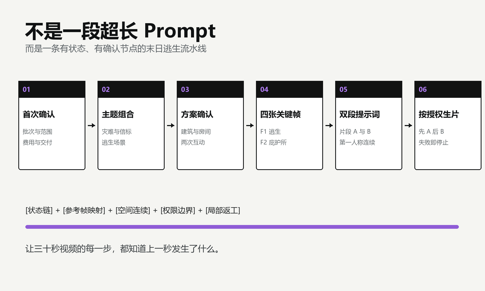

# AI Shelter Mini Skill

一个用于批量自动化制作末日逃生避难所短视频的开源 Agent Skill。

它把一条约 30 秒的视频拆成两段 15 秒连续镜头：第一段从灾难逃生、投出主题信标、穿过触发雾墙，到进入庇护所；第二段继续探索两个温暖内部空间，并完成两次可见反馈的治愈互动。


## 它能做什么

- 第一次调用先确认批次数、主题方式、视频规格、生成范围、费用、历史去重和交付方式。
- 随机提供跨品类的“灾难 + 主题物”候选，也支持用户指定主题。
- 每期生成两段 15 秒的中英文视频提示词。
- 规划并生成 F1 至 F4 四张连续关键场景图。
- 锁定第一人称单镜头、投掷因果链、穿雾显露和门洞连续性。
- 可一次规划或生成多期，按批次记录主题、参考帧和任务状态。
- 可选调用用户确认的视频工具；付费任务与重试都需要明确授权。
- 可选生成封面、正式标题、备选标题、简介和 Tags。
- 不绑定固定盘符、保存目录或视频平台。



## 工作流

```text
首次配置确认
      ↓
灾难与主题物候选
      ↓
确认逃生与庇护所方案
      ↓
生成双语提示词和 F1-F4
      ↓
检查因果与空间连续性
      ↓
按授权生成两段视频
      ↓
可选封面与发布文案
```

## 安装

使用支持 Agent Skills 的客户端：

```bash
npx skills add squashtrr-prog/ai-shelter-mini-skill
```

也可以克隆仓库后，将整个目录放入客户端的 Skills 目录。

```bash
git clone https://github.com/squashtrr-prog/ai-shelter-mini-skill.git
```

## 使用

安装后对 Agent 说：

```text
使用 ai-shelter-mini-open 帮我做一组末日逃生避难所视频。
```

第一次调用时会先确认：

```text
- 制作几期
- 指定主题还是随机候选
- 是否保持默认 2 × 15 秒和 9:16
- 只做内容包，还是同时生成图片或视频
- 视频工具、任务数量和可能费用
- 是否需要封面与发布文案
- 是否读取历史项目去重
- 结果直接返回还是保存到目录
```

确认完成后才开始选题和生成，不会因为以前使用过某个平台就自动提交付费视频任务。

## 四张关键帧

- F1：00 秒灾难逃生首帧。
- F2：08 秒穿过主题色雾墙后，第一次看见完整庇护所。
- F3：14 秒开门进入后的内部空间 1。
- F4：26 秒通过真实门进入的内部空间 2。

片段 A 使用 F1、F2、F3；片段 B 只使用 F3、F4。这样既能锁定外部逃生与建筑，也不会给第二段塞入无关参考图。

## 为什么不是一段超长 Prompt

末日逃生视频的难点不是缺少形容词，而是动作存在严格顺序。信标必须先离手再落地，落地后同一点才爆雾；人物必须穿过浓密核心以后才看见庇护所；进入室内以后，目标要先存在，人物走到自然距离才能伸手。

Skill 把这些因果关系、参考帧映射和确认节点写成不能跳过的步骤。失败时只重做不合格帧或对应片段，不需要推翻整期内容。

## 可移植性

开源版移除了所有固定本机路径。默认直接在对话中交付；需要保存时，可以使用用户指定目录或当前工作区的 `outputs` 相对目录。

视频生成采用工具适配方式，不写死某个平台。用户确认使用哪个工具、模型、比例、时长和任务数量后，Agent 才允许提交。

## 文件结构

```text
ai-shelter-mini-skill/
├── SKILL.md
├── README.md
├── LICENSE
├── agents/
│   └── openai.yaml
├── scripts/
│   └── init_project.ps1
└── references/
    ├── workflow-spec.md
    ├── prompt-continuity.md
    └── theme-pools.md
```

## 使用边界

- 实际图片和视频生成依赖宿主提供的工具；没有工具时仍可输出完整提示词。
- 调用可能消耗积分或费用的视频平台前，必须确认参数和总任务数。
- 平台返回技术成功不等同于内容质量通过；成片是否返工应由用户观看后决定。
- 发布前请检查模型条款、素材版权、内容标注和平台规则。

## License

[MIT](LICENSE) © 2026 [squashtrr-prog](https://github.com/squashtrr-prog)
