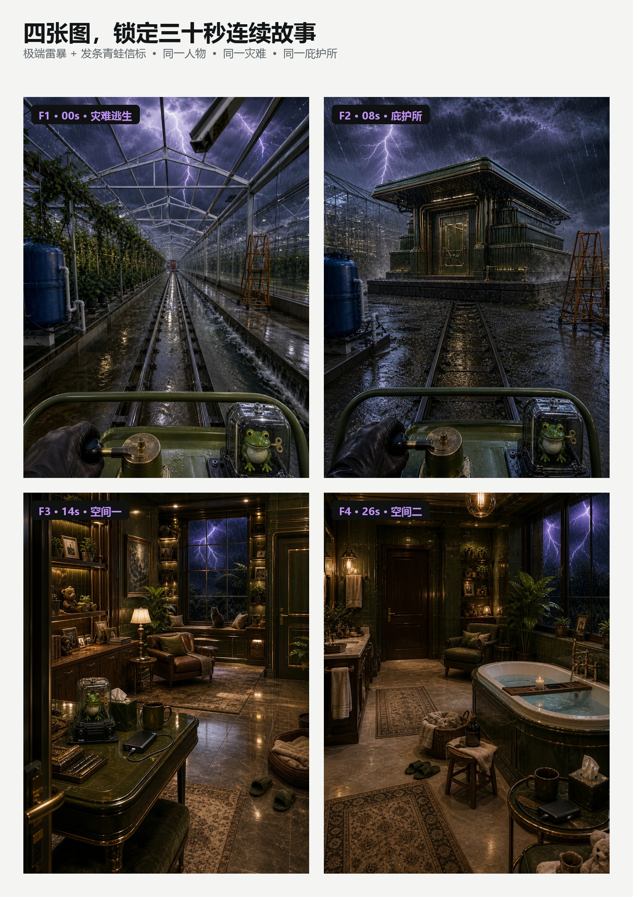

# 3个月发25篇，涨粉3.6万、获赞26万，我把这套庇护所视频工作流开源了

最近，我拆解了一个末日逃生庇护所类视频账号。

这个账号只用了 3 个月，就在小红书发布了 25 篇笔记，涨粉 3.6 万，累计获赞 26 万。按 25 篇粗略平均，每篇带来约 1440 名新增粉丝和超过 1 万次点赞。

这个结果真正让我在意的，不只是题材带来的视觉冲击，而是它证明了一件事：末日庇护所并不是只能偶尔做出一条爆款，它完全可以被拆成一套能够连续更新、反复复用的内容结构。

所以，我开始顺着它的镜头、动作、空间和转场，一层层往下拆。

镜头从灾难现场开始。人已经在往前逃，身后是暴雪、洪水、雷暴或者不断坍塌的城市。途中取下一件很小的主题物，向前投出去。物品落地，雾墙爆开，穿过去之后，一座原本不存在的庇护所出现在前方。

开门进去，外面的声音突然变远。里面是完全不同的世界：温暖、宽敞，有食物、热水、床、书、宠物和真正能住下来的生活痕迹。

这类视频的概念并不难懂。

真正麻烦的是让它连续发生。

物品不能还没落地，庇护所就提前出现；雾不能变成一块用来偷切镜头的白色遮罩；人不能上一秒还在车上，下一秒就站在门前；进入房间后，也不能隔着三米伸出一条很长的手去摸床。

做一条的时候，这些问题还能靠临时修改。要连续做很多期，靠记忆就很容易漏。

所以，我把自己一直在用的末日庇护所制作方法整理成了一个 Agent Skill，并且开源了。

GitHub 地址：https://github.com/squashtrr-prog/ai-shelter-mini-skill

它可以从随机灾难和主题物开始，自动完成逃生场景、庇护所外观、两个内部空间、四张关键帧、两段 15 秒双语视频提示词和发布文案。你明确授权以后，它还可以根据当前环境调用即梦 CLI 自动生成视频，或者接入 RunningHub 在远端生成。如果你更习惯自己控制模型，也可以只让它输出适配 MiniMax H3 的提示词和参考帧，再手动完成生成。

这篇文章，我想讲清楚：为什么这类视频真正需要的不是一条 Prompt，而是一条有状态、有确认节点的制作流水线。

## 一 底层原理是把三十秒拆成不能跳过的状态

末日庇护所视频看起来是一段连续故事，背后其实是一条严格的状态链。

人物先在灾难中持续前进，躲过一次贴近镜头的险情；然后取下已经存在的主题信标，清楚展示，只投掷一次。物品第一次落地以后，同一个落点才爆出雾墙。

接着，人不停车、不回头，沿着投掷方向穿过雾。浓雾内部始终看不到建筑。只有相机从远侧雾边出来以后，完整庇护所才第一次出现，而且入口已经近到可以马上停稳、下车、走到门前。

进入室内以后，顺序同样不能乱：先走到目标旁边，再停稳，再互动；互动结束以后先放回、松手、收回手臂，接着走到另一扇真实的门前，打开它，再进入第二个空间。

Skill 做的事情，就是把这条状态链写成不能跳过的约束。


## 二 四张关键帧不是四张漂亮概念图

整期内容只需要四张关键场景图。

- F1 是第 0 秒。灾难已经发生，人物正在逃生。
- F2 是第 8 秒。人刚从雾墙远侧出来，第一次看见完整庇护所。
- F3 是第 14 秒。门已经打开，内部空间 1 被完整揭示。
- F4 是第 26 秒。人物通过另一扇真实的门，进入内部空间 2。

它们不是互不相关的四张概念图，而是同一台第一人称相机在四个时间点经过的位置。

F1 到 F2 必须真的走得通。道路、坡面、护栏和固定地标的左右关系不能突然反过来，庇护所也不能换到另一条路上。F3 到 F4 则必须由一扇可以实际打开并穿过的门连接，而不是门板一遮，房间就换了。

这也是为什么片段 A 使用 F1、F2、F3，片段 B 只使用 F3、F4。参考图不是越多越好，关键是每张都承担明确的状态。



## 三 怎么用

整个流程分成三个清楚的确认节点。

### 第一步 安装并确认本次配置

安装命令：

```bash
npx skills add squashtrr-prog/ai-shelter-mini-skill
```

安装完成后，对 Agent 说：

```text
使用 ai-shelter-mini-open 帮我做一组末日逃生避难所视频。
```

第一次调用时，它不会马上抽主题或生成图片，而是先让你确认：要做几期、主题是自己指定还是随机、是否保持两段 15 秒、这次只做内容包还是继续生图和生视频、要不要封面、是否读取历史项目去重，以及结果是否需要保存。

视频生成被单独拿出来确认，是因为它可能消耗积分或费用。默认不会提交任何付费任务。只有你明确选定工具、模型、时长和任务数量以后，它才会继续。

我也把原来固定的保存位置删掉了。开源版默认直接返回内容；你想落盘时，可以指定自己的目录，也可以让它在当前工作区的 outputs 文件夹里新建项目。

### 第二步 选择灾难和主题物

如果你回复“随机”，Agent 会给出 6 组“灾难 + 主题物”。

这里的随机不是连续给出水壶、收音机、钟表和相机。它会先抽不同的一级品类，再抽具体物品，尽量让机械、科技、自然、手作、运动、生活和文化收藏拉开距离。

选定主题以后，它会继续确定逃生方式、外部场景、擦肩险情、庇护所体量、两个内部空间和两次互动，最后用一张确认卡让你一次看清整期方案。

### 第三步 自动完成内容包并按授权生成视频

方案确认后，Skill 会连续输出两段中英文视频提示词、四张关键帧提示词、参考帧映射、衔接说明和发布文案。

如果这次选择了生图，它会生成 F1 到 F4，并逐张检查人物高度、灾难方向、固定地标、庇护所外观、房间布局和互动目标。F1/F2 如果几何关系走不通，会作为一个连续单元重新检查。

如果这次还授权了视频生成，它才会调用你确认的平台：先生成片段 A，技术成功以后再生成片段 B。登录失败、余额不足、审核失败或者容量受限时，它会停止新增任务，不会偷偷换模型，也不会自动付费重试。

### 视频生成有三条可选路线

第一种是即梦 CLI。电脑里已经安装并配置好即梦 CLI 时，Skill 可以在你确认任务数量、模型和费用以后直接提交两段视频，等待任务完成并返回结果。这条路线适合希望从内容包一直自动跑到成片的人。

第二种是 MiniMax H3。Skill 不必直接连接平台，而是输出两段已经拆好时间轴、动作、镜头、首尾帧和参考帧映射的提示词。你可以先检查关键帧，再把提示词和图片手动放进 MiniMax H3。这样更适合想自己选择模型版本、逐段调整参数，或者需要在提交前再看一遍素材的人。

第三种是 RunningHub。接入 RunningHub 以后，可以把已经确认的工作流放到远端执行，本地只负责准备提示词、参考图、参数和读取任务状态。显卡和模型主要运行在远端，更适合批量任务，也能减少本地电脑长时间占用显存和内存。

### 为什么不默认自动连接本地 ComfyUI

我没有把本地 ComfyUI 的 MCP 调用设成默认自动路线。ComfyUI 在加载视频模型和处理多张参考图时，本身就会占用大量显存、内存、CPU 和磁盘读写。如果同时让 Agent 通过 MCP 保持连接、提交节点参数并持续查询状态，实际使用中更容易遇到超时、连接中断、状态回传失败或者任务已经在运行但 MCP 先报错的情况。

这不代表本地 ComfyUI 不能生成，而是它不适合被当成默认的一键批量通道。电脑配置充足、工作流已经稳定时，仍然可以在明确授权后接入；但日常使用里，我更建议把 ComfyUI 工作流手动打开，用 Skill 生成的提示词和参考帧运行。需要自动批量时，优先选择即梦 CLI 或 RunningHub，稳定性通常更好。

## 四 为什么 Skill 比一段超长 Prompt 更好用

一段 Prompt 能描述画面，却很难管理状态。

它不知道主题物在什么时候还应该留在支架上，什么时候已经离手；不知道建筑在雾里必须保持不可见，出雾以后又必须立刻稳定；也不知道第二段只需要 F3 和 F4，不应该把外部灾难图重新塞进去。

更重要的是，它很难处理权限。

做内容包、生成图片、提交两条视频、付费重试、制作封面，是五件不同的事。Skill 会把它们拆开确认。用户只授权两条视频，就只提交两条；平台失败以后要不要再花一次积分，必须重新问。

这种边界并没有让流程变慢。它让批量制作真正可控，因为最贵的错误通常不是提示词少写一个形容词，而是在错误的状态、错误的参考图或错误的授权下继续往后跑。

## 五 我的制作方式也被它改变了

以前做一条庇护所视频，我会一边看图一边往提示词里补规则。

第一次发现庇护所提前出现，就补一句“雾里不可见”；下一次发现车还没停人就瞬移到门前，再补一段下车动作；后来房间门一开又切镜，只能继续增加限制。

规则越来越多，但每次都要重新判断该把哪一条放在前面。

现在，我只需要先决定这期做什么灾难、用什么主题物，以及是否值得真的提交视频任务。

后面的时间轴、参考帧映射、投掷因果、穿雾显露、门洞连续和互动距离，会按同一套顺序展开。哪一张图失败，就重做哪一张；哪一段视频不满意，也不会影响已经通过的静态内容包。

我想开源的不是一组固定主题，而是这套可以连续做第二期、第三期，甚至一次规划很多期的生产方法。

## 六 最后的注意事项

这个 Skill 本身不提供图片或视频模型。它会优先使用你当前 Agent 环境里可用的工具；如果没有，就完整输出提示词和参考帧计划。

实际生成视频时，要留意平台的费用、审核、时长和参考图数量限制。即梦 CLI 和 RunningHub 适合在明确授权后继续自动执行；MiniMax H3 则可以保留人工提交和调参的空间。平台返回“生成成功”只代表文件已经生成，不代表动作、声音和连续性一定符合预期。是否重做，仍然应该由你看完成片以后决定。

如果你准备使用本地 ComfyUI，建议先单独确认模型能够正常加载、显存余量足够、工作流可以手动跑通，再决定是否接入 MCP。不要在本地模型已经满载时，继续叠加自动调用和长时间状态查询，否则一次通信报错就可能让 Agent 无法判断任务究竟失败了，还是仍在后台运行。

末日灾难题材也需要注意平台内容规则。紧张感可以来自灾难规模、路线受限、相对速度和真实受力，不需要依靠血腥伤害、武器或者人物受难画面。

我开源的不是一条把所有禁令都塞进去的超长 Prompt。

更重要的是，把末日逃生视频里最容易失控的因果、空间、参考帧和权限，整理成一条可以批量执行、可以中途停止、也可以局部返工的工作流。

GitHub：https://github.com/squashtrr-prog/ai-shelter-mini-skill

希望它能帮你少补几遍规则，少浪费几次生成额度，更稳定地做出从灾难现场一路走进安全空间的末日庇护所视频。
